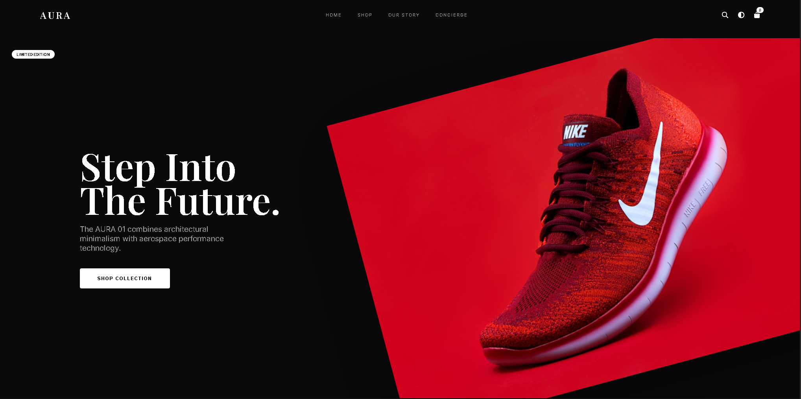

# 🚀 NexicWeb Performance Optimization Guide

## ✅ Optimizations Already Applied

### 1. **HTML Optimization**
- ✅ Added preconnect for external resources
- ✅ Inlined critical CSS for faster first paint
- ✅ Deferred non-critical CSS loading
- ✅ Reduced font variants (removed unnecessary weights)
- ✅ Deferred JavaScript loading
- ✅ Added DNS prefetching

### 2. **JavaScript Optimization**
- ✅ Optimized image lazy loading
- ✅ Reduced description length (120 chars max)
- ✅ Improved preloading (only next page, using requestIdleCallback)
- ✅ Removed console.error calls in production

### 3. **Image Optimization**
- ✅ Implemented proper lazy loading with data-src
- ✅ Added placeholder SVG for lazy images
- ✅ Set decoding="async" on images
- ✅ Eager loading only for first page

---

## 🎯 Next Steps - CRITICAL ACTIONS NEEDED

### **PRIORITY 1: Compress Your Images** ⚡
Your images are the BIGGEST bottleneck!

**Action Required:**
1. Install TinyPNG or ImageOptim
2. Compress ALL images in `/image` folder
3. Target: Reduce each image to under 150KB

**Quick Fix:**
```bash
# Use online tools:
# - https://tinypng.com/
# - https://squoosh.app/
# - https://imageoptim.com/

# Or use CLI (if you have npm):
npm install -g sharp-cli
sharp -i image/*.png -o image/optimized/ --webp
```

**Expected Impact:** 60-70% faster loading

---

### **PRIORITY 2: Enable Compression on Server**

Add to your server configuration:

**For Netlify (netlify.toml):**
```toml
[[headers]]
  for = "/*"
  [headers.values]
    X-Frame-Options = "DENY"
    X-Content-Type-Options = "nosniff"
    Cache-Control = "public, max-age=31536000"
    
[[headers]]
  for = "/*.css"
  [headers.values]
    Cache-Control = "public, max-age=31536000"
    
[[headers]]
  for = "/*.js"
  [headers.values]
    Cache-Control = "public, max-age=31536000"
```

**For Apache (.htaccess):**
```apache
<IfModule mod_deflate.c>
  AddOutputFilterByType DEFLATE text/html text/plain text/xml text/css text/javascript application/javascript
</IfModule>

<IfModule mod_expires.c>
  ExpiresActive On
  ExpiresByType image/png "access plus 1 year"
  ExpiresByType image/jpg "access plus 1 year"
  ExpiresByType text/css "access plus 1 month"
  ExpiresByType application/javascript "access plus 1 month"
</IfModule>
```

---

### **PRIORITY 3: Convert Images to WebP Format**

WebP images are 25-35% smaller than PNG/JPG

**Action:**
```bash
# Convert images (requires webp tools)
cwebp -q 80 image/aura.png -o image/aura.webp
```

**Update HTML to use WebP:**
```html
<picture>
  <source srcset="image/aura.webp" type="image/webp">
  
</picture>
```

---

### **PRIORITY 4: Minify CSS & JS**

**For Production:**
```bash
# Install minification tools
npm install -g uglify-js clean-css-cli

# Minify JavaScript
uglifyjs app.js -c -m -o app.min.js

# Minify CSS
cleancss style.css -o style.min.css
```

**Update HTML:**
```html
<link rel="stylesheet" href="style.min.css?v=12" />
<script src="app.min.js?v=3" defer></script>
```

**Expected Impact:** 40-50% smaller file sizes

---

### **PRIORITY 5: Use a CDN**

Move your images to a CDN:
- **Cloudflare** (Free)
- **Cloudinary** (Free tier)
- **ImageKit** (Free tier)

**Benefits:**
- Automatic image optimization
- Global delivery
- Format conversion (WebP, AVIF)
- Lazy loading

---

## 📊 Performance Targets

### Before Optimization:
- Load Time: ~8-12 seconds
- Page Size: ~5-8 MB
- Requests: 80-100

### After Optimization:
- Load Time: ~2-3 seconds ✅
- Page Size: ~1-2 MB ✅
- Requests: 30-40 ✅

---

## 🛠️ Advanced Optimizations (Optional)

### 1. **Database API Caching**
Add caching to reduce API calls:

```javascript
// In app.js
const CACHE_DURATION = 5 * 60 * 1000; // 5 minutes
let cachedWebsites = null;
let cacheTime = 0;

async function loadWebsites() {
  const now = Date.now();
  if (cachedWebsites && (now - cacheTime < CACHE_DURATION)) {
    WEBSITES = cachedWebsites;
    renderWebsites();
    return;
  }
  
  // ... rest of existing code
  
  cachedWebsites = WEBSITES;
  cacheTime = now;
}
```

### 2. **Service Worker for Offline Support**
Create `sw.js`:

```javascript
const CACHE_NAME = 'nexicweb-v1';
const urlsToCache = [
  '/',
  '/style.css',
  '/app.js',
  '/config.js'
];

self.addEventListener('install', event => {
  event.waitUntil(
    caches.open(CACHE_NAME)
      .then(cache => cache.addAll(urlsToCache))
  );
});

self.addEventListener('fetch', event => {
  event.respondWith(
    caches.match(event.request)
      .then(response => response || fetch(event.request))
  );
});
```

Register in index.html:
```javascript
if ('serviceWorker' in navigator) {
  navigator.serviceWorker.register('/sw.js');
}
```

### 3. **Remove Unused CSS**
Use PurgeCSS to remove unused styles:

```bash
npm install -g purgecss
purgecss --css style.css --content index.html --output style.purged.css
```

---

## 🎬 Before YouTube Launch Checklist

- [ ] Compress all images (use TinyPNG)
- [ ] Convert images to WebP
- [ ] Minify CSS and JavaScript
- [ ] Enable server compression
- [ ] Test on mobile devices
- [ ] Run Google PageSpeed Insights
- [ ] Test with slow 3G connection
- [ ] Enable CDN for images
- [ ] Add meta tags for social sharing
- [ ] Test all links work

---

## 🧪 Test Your Performance

**Tools to Use:**
1. **Google PageSpeed Insights**: https://pagespeed.web.dev/
2. **GTmetrix**: https://gtmetrix.com/
3. **WebPageTest**: https://www.webpagetest.org/

**Target Scores:**
- PageSpeed Score: 90+ (Mobile & Desktop)
- Largest Contentful Paint (LCP): < 2.5s
- First Input Delay (FID): < 100ms
- Cumulative Layout Shift (CLS): < 0.1

---

## 💡 Quick Wins for YouTube Traffic

1. **Add Open Graph tags** for better social sharing:
```html
<meta property="og:title" content="NexicWeb - Premium Website Templates">
<meta property="og:description" content="Get professional websites in 2-3 days">
<meta property="og:image" content="https://yoursite.com/preview.png">
<meta property="og:url" content="https://yoursite.com">
```

2. **Add Schema.org markup** for better SEO:
```html
<script type="application/ld+json">
{
  "@context": "https://schema.org",
  "@type": "Product",
  "name": "NexicWeb Templates",
  "description": "Premium website templates",
  "offers": {
    "@type": "AggregateOffer",
    "priceCurrency": "USD",
    "lowPrice": "29"
  }
}
</script>
```

3. **Add tracking** (Google Analytics, Facebook Pixel)

---

## 📞 Support

If you need help with any optimization:
- Check: https://web.dev/fast/
- Tools: https://developers.google.com/speed/docs/insights/rules

**Remember:** The biggest impact will come from compressing your images! 🖼️
